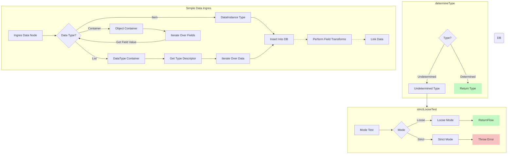

simple-object-model
================
## Purpose
Provides a library for rapidly prototyping with a data model with related objects that span 'types' or tables.

## Motivation
I wanted a super lightweight way to quickly up a data model from a JSON source, and one that I could easily implement
across languages/platforms.

## Description
This is a simple library that provides a context for performing some simple ORM style behaviors for data with little to no up front configuration. 

 on simple conventions of the shape of data, while also allowing for inline configuration to handle more complex data and convention overrides. This is intended to be used for quick prototyping, and is meant to be eventually  by a more robust ORM or data modeling library once the requirements are better understood.

- linking - it will link objects together based on conventions in the data e.g. _k field indicates a key. _{name} indicates a one-to-one reference to another table. _{name}_s indicates a one-to-many reference to another table.

- field transformations - it can perform transformations of the values of fields, such as a date string into a date object. This is configured with simple inline declarations.

- access - provides a simple way to access the data in the model, and to perform simple queries on the data

### Principles
- **Convention over Configuration** -  It will do the right thing with no configuration, but can be configured inline to handle more complex data or to override conventions.


### Usage

#### Basic Mode - No/Inline Configuration

Take in list or hierarchical data and perform a 'best effort' to create a linked data model from it based on conventions 
in the shape of the data or via additional metadata that is not necessary but supplemental. Can be mixed in as a 

To put it another way it allows very quick modeling with data that is effectively schema mixed with data. 

It can extend JSON data and link the data together via some field conventions.

It creates 'tables' to sort data on determined 'types' and 'keys' in the data.

There are two primary types expected - a container and an item. 

In the simplest behavior if you give it an object it will determine if it is a container or an item. 

if it is an item it will be inserted into the correct Table. If type is undetermined it will be added to the 'unknown'
table (or throw an error in strict mode). 

If it is a container it will create a table if one doesn't already exist based on the container name and definition and
then add the items to the table.

#### Basic Mode Glossary

**Data Node**: A data node that will be brought into the model

**Data Node Type**: The type of the data node.

**Node Type Object Container**: A data node that can contain other potential data nodes

**Data Type**: The type of the data *within* the model

### JSON Data Example


```JSON 
{
  "unitedStates": {
    "data": [
      {
        "_k": "US_AL",
        "name": "Alabama"
      },
      {
        "_k": "US_AK",
        "name": "Alaska"
      },
      {
          "_k": "US_AZ",
          "name": "Arizona"
      }
    ]
  }
}
```

**System Conventions**
- _k field indicates a key
- _{name} indicates a one-to-one reference to another table
- _{name}_s indicates a one-to-many reference to another table
- a 'data' field indicates the object is a container, and data contains items

## Todo

### Features
- [ ] Default to using _id as key field instead of _k just bc it is more common
- [ ] Nested 'Tables'
- [ ] Allow multiple calls of loadData
- [ ] Mutation/Addition
- [ ] Asynchronous

### Performance
  - [ ] Currently, it processes each object de novo, without awareness of expected shape. Probably want this in most cases. Can add with metadata, or version expectation and warnings when it's not doing this.

### Dev Automation
- [ ] ESLint
- [ ] Add pre-commit hooks
  - [ ] Prettier
  - [ ] ESLint
  - [ ] Tests


## Glossary

Table - defines a peer list of the same 'type' of data. Has a name
